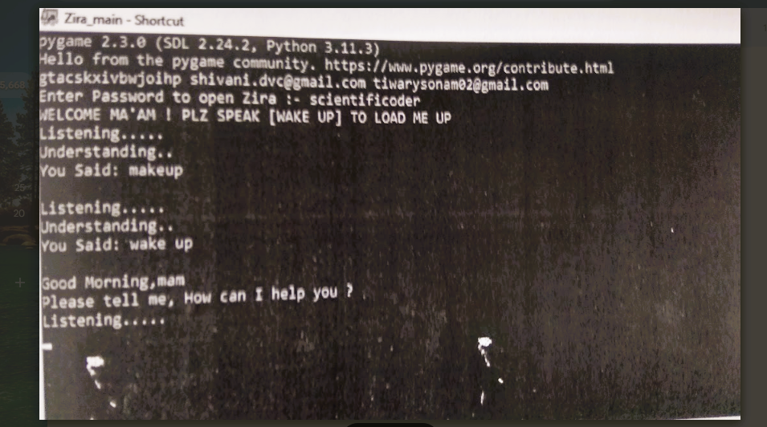

## Introduction
<p>
Virtual assistant are software program that facilitate your easy day to day tasks,like showing weather report creating reminder,open webcam etc.they'll take commands via text(online chat bot) or by voice.web searches conducted via mobile devices have only just overtaken those carried out using a computer and the analyst are already predicting that 90% of searches will be via voice by 2027.

The project was started on the premise that there is sufficient amount of openly available data and information on the web rthat can be utilized tobuild a virtual assistant that has access to making intelligent decisions for routine user activities.

The data in this project is nothing but user input,whatever the user says,the assistant performs the task accordingly.The user input is nothing specific but the list of tasks which a user wants to get performed in human language intelligence.
</p>

## Aim
<p> 
To enhance productivity and user experience by leveraging artificial intelligence to automate tasks, provide real-time information, and offer interactive, personalized   support in a compact, accessible form factor.  
</p>

## Project Scope
- Task Automation & System Management: Developing a system capable of managing daily computing tasks, such as opening applications, setting reminders, organizing files, sending emails, and controlling system operations (e.g., locking/shutting down) through voice commands or text input.
- Intelligent Interaction & Personalization: Implementing Natural Language Processing (NLP) and Machine Learning (ML) to facilitate natural, conversational interaction  (chat) and adapt to user preferences over time, including web searches, news/weather updates, and providing proactive, context-aware information. 

  
## Technology Used:
- #### Languages:
  - 

- #### Machine-Learning Algorithms:
  - <a href="https://en.wikipedia.org/wiki/Natural_language_processing">**NATURAL LANGUAGE PROCESSING**</a>

- #### ML/DL:
  - 
  - 

- #### IDE:
  - 

- #### OS used for testing:
  - 
  - 
  - 

## Project Installation:
**STEP 1:** Clone the repository from GitHub.
```bash
  git clone https://github.com/Jhanwi/Intelligent-Desktop-Companion.git
```

**STEP 2:** Change the directory to the repository.
```bash
  cd Intelligent-Desktop-Companion
```

**STEP 3:** Create a virtual environment
(For Windows)
```bash
  python -m venv virtualenv
```
(For MacOS and Linux)
```bash
  python3 -m venv virtualenv
```

**STEP 4:** Activate the virtual environment.
(For Windows)
```bash
  virtualenv\Scripts\activate
```
(For MacOS and Linux)
```bash
  source virtualenv/bin/activate
```

**STEP 5:** Install the dependencies.
```bash
  python -m pip install -r requirements.txt
```

**STEP 7:** Run the application.
(For Windows)
```bash
  python Zira_main.py
```
(For MacOS and Linux)
```bash
  python3 Zira_main.py
```
## Output Screen-shots:
#### When the assistant is loaded first it will greet the user


#### The assistant will display the news line by line and it will also read out the news


#### The assistant will search the query of user on GOOGLE


#### The assistant will search the query of user on YOUTUBE


#### The assistant will search the query given by user on WIKIPEDIA


#### The assistant will play a game with user whenever the user wants to play the game with assistant


#### The assistant will translate the sentence given by the user in the specified language selected by the user


#### The assistant will send an email according to the information given by the user


#### The assistant will oen notepad when the user gives the command


#### Other function :- Like set an alarm,tell the weather report, temperature, times, jokes, intenet speed, schedule a day for you,                              remember things for you,take a screenshot,do a calculationfor you, shutdown the system,controlling the volume etc.


